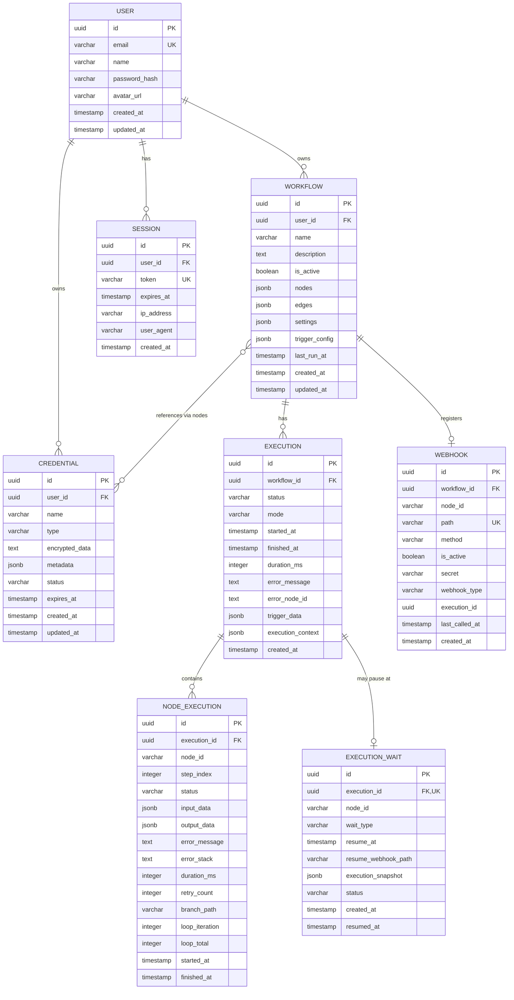

# Entity Relationship Diagram (ERD)

# FlowForge — Complete Database Schema

**Version:** 1.2 MVP (React Flow Edition)
**Last Updated:** February 20, 2026
**Database:** PostgreSQL 16  
**ORM:** Drizzle ORM

---

## 1. ER Diagram (Mermaid)



---

## 2. Detailed Table Schemas

### 2.1 users

The core user account table.

```sql
CREATE TABLE users (
    id              UUID PRIMARY KEY DEFAULT gen_random_uuid(),
    email           VARCHAR(255) UNIQUE NOT NULL,
    name            VARCHAR(255) NOT NULL,
    password_hash   VARCHAR(255) NOT NULL,
    avatar_url      VARCHAR(500),
    created_at      TIMESTAMPTZ NOT NULL DEFAULT NOW(),
    updated_at      TIMESTAMPTZ NOT NULL DEFAULT NOW()
);

CREATE INDEX idx_users_email ON users(email);
```

| Column        | Type         | Constraints             | Description            |
| ------------- | ------------ | ----------------------- | ---------------------- |
| id            | UUID         | PK, auto-generated      | Unique user identifier |
| email         | VARCHAR(255) | UNIQUE, NOT NULL        | Login email address    |
| name          | VARCHAR(255) | NOT NULL                | Display name           |
| password_hash | VARCHAR(255) | NOT NULL                | bcrypt hashed password |
| avatar_url    | VARCHAR(500) | nullable                | Profile picture URL    |
| created_at    | TIMESTAMPTZ  | NOT NULL, default NOW() | Account creation time  |
| updated_at    | TIMESTAMPTZ  | NOT NULL, default NOW() | Last profile update    |

---

### 2.2 sessions

Server-side session store for authentication.

```sql
CREATE TABLE sessions (
    id              UUID PRIMARY KEY DEFAULT gen_random_uuid(),
    user_id         UUID NOT NULL REFERENCES users(id) ON DELETE CASCADE,
    token           VARCHAR(255) UNIQUE NOT NULL,
    expires_at      TIMESTAMPTZ NOT NULL,
    ip_address      VARCHAR(45),
    user_agent      TEXT,
    created_at      TIMESTAMPTZ NOT NULL DEFAULT NOW()
);

CREATE INDEX idx_sessions_token ON sessions(token);
CREATE INDEX idx_sessions_user_id ON sessions(user_id);
CREATE INDEX idx_sessions_expires_at ON sessions(expires_at);
```

| Column     | Type         | Constraints                      | Description                                     |
| ---------- | ------------ | -------------------------------- | ----------------------------------------------- |
| id         | UUID         | PK                               | Session identifier                              |
| user_id    | UUID         | FK → users.id, ON DELETE CASCADE | Owner of the session                            |
| token      | VARCHAR(255) | UNIQUE, NOT NULL                 | Session token (stored in httpOnly cookie)       |
| expires_at | TIMESTAMPTZ  | NOT NULL                         | Session expiry (default: 30 days from creation) |
| ip_address | VARCHAR(45)  | nullable                         | Client IP for audit                             |
| user_agent | TEXT         | nullable                         | Browser/client info for audit                   |
| created_at | TIMESTAMPTZ  | NOT NULL                         | Session creation time                           |

---

### 2.3 workflows

The core workflow definition table. Nodes and edges are stored as JSONB, keeping the schema flexible as node types evolve. The JSONB schema now supports branching (IF true/false paths), loop containers, wait nodes, and merge nodes.

```sql
CREATE TABLE workflows (
    id              UUID PRIMARY KEY DEFAULT gen_random_uuid(),
    user_id         UUID NOT NULL REFERENCES users(id) ON DELETE CASCADE,
    name            VARCHAR(255) NOT NULL DEFAULT 'Untitled Workflow',
    description     TEXT DEFAULT '',
    is_active       BOOLEAN NOT NULL DEFAULT FALSE,
    nodes           JSONB NOT NULL DEFAULT '[]',
    edges           JSONB NOT NULL DEFAULT '[]',
    settings        JSONB NOT NULL DEFAULT '{}',
    trigger_config  JSONB DEFAULT NULL,
    last_run_at     TIMESTAMPTZ,
    created_at      TIMESTAMPTZ NOT NULL DEFAULT NOW(),
    updated_at      TIMESTAMPTZ NOT NULL DEFAULT NOW()
);

CREATE INDEX idx_workflows_user_id ON workflows(user_id);
CREATE INDEX idx_workflows_is_active ON workflows(is_active);
CREATE INDEX idx_workflows_updated_at ON workflows(updated_at DESC);
```

| Column         | Type         | Constraints             | Description                                                             |
| -------------- | ------------ | ----------------------- | ----------------------------------------------------------------------- |
| id             | UUID         | PK                      | Workflow identifier                                                     |
| user_id        | UUID         | FK → users.id           | Owner                                                                   |
| name           | VARCHAR(255) | NOT NULL                | User-facing workflow name                                               |
| description    | TEXT         | default ''              | Optional description                                                    |
| is_active      | BOOLEAN      | NOT NULL, default FALSE | Whether triggers are listening                                          |
| nodes          | JSONB        | NOT NULL, default '[]'  | Array of WorkflowNode objects (see 3.1)                                 |
| edges          | JSONB        | NOT NULL, default '[]'  | Array of WorkflowEdge objects (see 3.2)                                 |
| settings       | JSONB        | NOT NULL, default '{}'  | Workflow-level settings (see 3.3)                                       |
| trigger_config | JSONB        | nullable                | Denormalized trigger setup for quick access by scheduler/webhook router |
| last_run_at    | TIMESTAMPTZ  | nullable                | Timestamp of most recent execution                                      |
| created_at     | TIMESTAMPTZ  | NOT NULL                | Creation time                                                           |
| updated_at     | TIMESTAMPTZ  | NOT NULL                | Last modification time                                                  |

---

### 2.4 credentials

Encrypted storage for third-party service credentials.

```sql
CREATE TABLE credentials (
    id              UUID PRIMARY KEY DEFAULT gen_random_uuid(),
    user_id         UUID NOT NULL REFERENCES users(id) ON DELETE CASCADE,
    name            VARCHAR(255) NOT NULL,
    type            VARCHAR(100) NOT NULL,
    encrypted_data  TEXT NOT NULL,
    metadata        JSONB NOT NULL DEFAULT '{}',
    status          VARCHAR(50) NOT NULL DEFAULT 'active',
    expires_at      TIMESTAMPTZ,
    created_at      TIMESTAMPTZ NOT NULL DEFAULT NOW(),
    updated_at      TIMESTAMPTZ NOT NULL DEFAULT NOW()
);

CREATE INDEX idx_credentials_user_id ON credentials(user_id);
CREATE INDEX idx_credentials_type ON credentials(type);
```

| Column         | Type         | Constraints                | Description                                                                                      |
| -------------- | ------------ | -------------------------- | ------------------------------------------------------------------------------------------------ |
| id             | UUID         | PK                         | Credential identifier                                                                            |
| user_id        | UUID         | FK → users.id              | Owner                                                                                            |
| name           | VARCHAR(255) | NOT NULL                   | User-facing name (e.g., "My Telegram Bot")                                                       |
| type           | VARCHAR(100) | NOT NULL                   | Credential type: `telegram_bot`, `google_oauth2`                                                 |
| encrypted_data | TEXT         | NOT NULL                   | AES-256-GCM encrypted JSON string containing the actual secrets                                  |
| metadata       | JSONB        | default '{}'               | Non-secret metadata (e.g., `{ "botUsername": "my_bot" }`, `{ "googleEmail": "user@gmail.com" }`) |
| status         | VARCHAR(50)  | NOT NULL, default 'active' | `active`, `expired`, `revoked`, `error`                                                          |
| expires_at     | TIMESTAMPTZ  | nullable                   | When the credential expires (for OAuth tokens)                                                   |
| created_at     | TIMESTAMPTZ  | NOT NULL                   | Creation time                                                                                    |
| updated_at     | TIMESTAMPTZ  | NOT NULL                   | Last update time                                                                                 |

**Encrypted Data Structure by Type:**

```typescript
// type: 'telegram_bot'
{
  botToken: string; // "123456:ABC-DEF..."
}

// type: 'google_oauth2'
{
  clientId: string;
  clientSecret: string;
  accessToken: string;
  refreshToken: string;
  tokenType: string; // "Bearer"
  expiresAt: number; // Unix timestamp
  scope: string; // "https://www.googleapis.com/auth/spreadsheets ..."
}
```

---

### 2.5 executions

Records every run of every workflow. Now includes `execution_context` for tracking branch and loop state.

```sql
CREATE TABLE executions (
    id                  UUID PRIMARY KEY DEFAULT gen_random_uuid(),
    workflow_id         UUID NOT NULL REFERENCES workflows(id) ON DELETE CASCADE,
    status              VARCHAR(50) NOT NULL DEFAULT 'pending',
    mode                VARCHAR(50) NOT NULL DEFAULT 'manual',
    started_at          TIMESTAMPTZ,
    finished_at         TIMESTAMPTZ,
    duration_ms         INTEGER,
    error_message       TEXT,
    error_node_id       VARCHAR(100),
    trigger_data        JSONB DEFAULT '{}',
    execution_context   JSONB DEFAULT '{}',
    created_at          TIMESTAMPTZ NOT NULL DEFAULT NOW()
);

-- Composite index for the most common query: "list executions for a workflow, newest first"
CREATE INDEX idx_executions_workflow_status ON executions(workflow_id, status, created_at DESC);
CREATE INDEX idx_executions_created_at ON executions(created_at DESC);
CREATE INDEX idx_executions_status ON executions(status);
```

| Column            | Type         | Constraints       | Description                                                                                                          |
| ----------------- | ------------ | ----------------- | -------------------------------------------------------------------------------------------------------------------- |
| id                | UUID         | PK                | Execution identifier                                                                                                 |
| workflow_id       | UUID         | FK → workflows.id | Which workflow was executed                                                                                          |
| status            | VARCHAR(50)  | NOT NULL          | `pending`, `running`, `success`, `failed`, `cancelled`, `timeout`, `waiting`                                         |
| mode              | VARCHAR(50)  | NOT NULL          | `manual`, `trigger`, `webhook`, `schedule`, `retry`                                                                  |
| started_at        | TIMESTAMPTZ  | nullable          | When execution actually started (after dequeue)                                                                      |
| finished_at       | TIMESTAMPTZ  | nullable          | When execution completed                                                                                             |
| duration_ms       | INTEGER      | nullable          | Total execution duration in milliseconds (excludes wait time for Wait nodes)                                         |
| error_message     | TEXT         | nullable          | Top-level error message if failed                                                                                    |
| error_node_id     | VARCHAR(100) | nullable          | ID of the node that caused the failure                                                                               |
| trigger_data      | JSONB        | default '{}'      | The input data that triggered this execution (webhook body, cron timestamp, etc.)                                    |
| execution_context | JSONB        | default '{}'      | Runtime context: active branch paths, loop states, wait state. Used for resuming paused executions. See section 3.5. |
| created_at        | TIMESTAMPTZ  | NOT NULL          | When the execution was enqueued                                                                                      |

**Status Transitions:**

```
pending → running → success
pending → running → failed
pending → running → timeout
pending → running → cancelled
pending → running → waiting → running → success    (Wait node pause/resume)
pending → running → waiting → running → failed
pending → running → waiting → cancelled
pending → cancelled
```

---

### 2.6 node_executions

Per-node execution data within an execution. Now includes `branch_path` and `loop_iteration` for tracking branching and loop context.

```sql
CREATE TABLE node_executions (
    id              UUID PRIMARY KEY DEFAULT gen_random_uuid(),
    execution_id    UUID NOT NULL REFERENCES executions(id) ON DELETE CASCADE,
    node_id         VARCHAR(100) NOT NULL,
    step_index      INTEGER NOT NULL,
    status          VARCHAR(50) NOT NULL DEFAULT 'pending',
    input_data      JSONB DEFAULT '{}',
    output_data     JSONB DEFAULT '{}',
    error_message   TEXT,
    error_stack     TEXT,
    duration_ms     INTEGER,
    retry_count     INTEGER NOT NULL DEFAULT 0,
    branch_path     VARCHAR(500),
    loop_iteration  INTEGER,
    loop_total      INTEGER,
    started_at      TIMESTAMPTZ,
    finished_at     TIMESTAMPTZ
);

CREATE INDEX idx_node_executions_execution_id ON node_executions(execution_id);
CREATE INDEX idx_node_executions_composite ON node_executions(execution_id, step_index);
CREATE INDEX idx_node_executions_branch ON node_executions(execution_id, branch_path);
```

| Column         | Type         | Constraints                           | Description                                                                                                                                                   |
| -------------- | ------------ | ------------------------------------- | ------------------------------------------------------------------------------------------------------------------------------------------------------------- |
| id             | UUID         | PK                                    | Node execution record identifier                                                                                                                              |
| execution_id   | UUID         | FK → executions.id, ON DELETE CASCADE | Parent execution                                                                                                                                              |
| node_id        | VARCHAR(100) | NOT NULL                              | Matches the node ID in the workflow's JSONB `nodes` array                                                                                                     |
| step_index     | INTEGER      | NOT NULL                              | Sequential step number (0-based)                                                                                                                              |
| status         | VARCHAR(50)  | NOT NULL                              | `pending`, `running`, `success`, `failed`, `skipped`, `waiting`                                                                                               |
| input_data     | JSONB        | default '{}'                          | The resolved input data the node received                                                                                                                     |
| output_data    | JSONB        | default '{}'                          | The data the node produced                                                                                                                                    |
| error_message  | TEXT         | nullable                              | Human-readable error message                                                                                                                                  |
| error_stack    | TEXT         | nullable                              | Full error stack trace (for debugging)                                                                                                                        |
| duration_ms    | INTEGER      | nullable                              | How long this node took in milliseconds                                                                                                                       |
| retry_count    | INTEGER      | default 0                             | How many times this node was retried                                                                                                                          |
| branch_path    | VARCHAR(500) | nullable                              | Dot-notation path indicating which branch this execution belongs to, e.g., `"true"`, `"false"`, `"true.true"` for nested branches. NULL for non-branch nodes. |
| loop_iteration | INTEGER      | nullable                              | Which iteration of a loop this record belongs to (0-based). NULL if not inside a loop.                                                                        |
| loop_total     | INTEGER      | nullable                              | Total number of iterations in the parent loop. NULL if not inside a loop.                                                                                     |
| started_at     | TIMESTAMPTZ  | nullable                              | When this node started                                                                                                                                        |
| finished_at    | TIMESTAMPTZ  | nullable                              | When this node finished                                                                                                                                       |

---

### 2.7 webhooks

Registered webhook endpoints for workflows with Webhook triggers. Now also supports Wait node resume webhooks.

```sql
CREATE TABLE webhooks (
    id              UUID PRIMARY KEY DEFAULT gen_random_uuid(),
    workflow_id     UUID NOT NULL REFERENCES workflows(id) ON DELETE CASCADE,
    node_id         VARCHAR(100) NOT NULL,
    path            VARCHAR(255) UNIQUE NOT NULL,
    method          VARCHAR(10) NOT NULL DEFAULT 'POST',
    is_active       BOOLEAN NOT NULL DEFAULT FALSE,
    secret          VARCHAR(255),
    webhook_type    VARCHAR(50) NOT NULL DEFAULT 'trigger',
    execution_id    UUID REFERENCES executions(id) ON DELETE SET NULL,
    last_called_at  TIMESTAMPTZ,
    created_at      TIMESTAMPTZ NOT NULL DEFAULT NOW()
);

CREATE INDEX idx_webhooks_path ON webhooks(path);
CREATE INDEX idx_webhooks_is_active ON webhooks(is_active);
CREATE INDEX idx_webhooks_type ON webhooks(webhook_type);
CREATE INDEX idx_webhooks_execution ON webhooks(execution_id) WHERE execution_id IS NOT NULL;
```

| Column         | Type         | Constraints                  | Description                                                                                  |
| -------------- | ------------ | ---------------------------- | -------------------------------------------------------------------------------------------- |
| id             | UUID         | PK                           | Webhook identifier                                                                           |
| workflow_id    | UUID         | FK → workflows.id            | Associated workflow                                                                          |
| node_id        | VARCHAR(100) | NOT NULL                     | The trigger/Wait node's ID in the workflow                                                   |
| path           | VARCHAR(255) | UNIQUE, NOT NULL             | URL path segment: `/webhook/{path}`. Auto-generated nanoid.                                  |
| method         | VARCHAR(10)  | NOT NULL, default 'POST'     | Accepted HTTP method: `POST`, `GET`, `ANY`                                                   |
| is_active      | BOOLEAN      | NOT NULL, default FALSE      | Synced with workflow's `is_active` for triggers; always true for active wait-resume webhooks |
| secret         | VARCHAR(255) | nullable                     | HMAC secret for webhook signature verification                                               |
| webhook_type   | VARCHAR(50)  | NOT NULL, default 'trigger'  | `trigger` (normal workflow trigger) or `wait_resume` (resume a paused Wait node)             |
| execution_id   | UUID         | FK → executions.id, nullable | For `wait_resume` type: the execution ID to resume. NULL for trigger webhooks.               |
| last_called_at | TIMESTAMPTZ  | nullable                     | Timestamp of last incoming webhook call                                                      |
| created_at     | TIMESTAMPTZ  | NOT NULL                     | Registration time                                                                            |

**Note:** The UNIQUE constraint on `workflow_id` from the original schema has been removed. A workflow may now have multiple webhook records: one for a Webhook trigger and potentially one or more for Wait node resume endpoints (though only one Wait resume is active per execution).

---

### 2.8 execution_waits

Tracks paused executions waiting on a duration or external event. This table enables durability: if the server restarts, waiting executions can be recovered and resumed.

```sql
CREATE TABLE execution_waits (
    id                      UUID PRIMARY KEY DEFAULT gen_random_uuid(),
    execution_id            UUID UNIQUE NOT NULL REFERENCES executions(id) ON DELETE CASCADE,
    node_id                 VARCHAR(100) NOT NULL,
    wait_type               VARCHAR(50) NOT NULL,
    resume_at               TIMESTAMPTZ,
    resume_webhook_path     VARCHAR(255),
    execution_snapshot      JSONB NOT NULL DEFAULT '{}',
    status                  VARCHAR(50) NOT NULL DEFAULT 'waiting',
    created_at              TIMESTAMPTZ NOT NULL DEFAULT NOW(),
    resumed_at              TIMESTAMPTZ
);

CREATE INDEX idx_execution_waits_status ON execution_waits(status);
CREATE INDEX idx_execution_waits_resume_at ON execution_waits(resume_at) WHERE status = 'waiting';
CREATE INDEX idx_execution_waits_webhook ON execution_waits(resume_webhook_path) WHERE status = 'waiting';
```

| Column              | Type         | Constraints                 | Description                                                                                                                                                                      |
| ------------------- | ------------ | --------------------------- | -------------------------------------------------------------------------------------------------------------------------------------------------------------------------------- |
| id                  | UUID         | PK                          | Wait record identifier                                                                                                                                                           |
| execution_id        | UUID         | FK → executions.id, UNIQUE  | The paused execution (one wait per execution at a time)                                                                                                                          |
| node_id             | VARCHAR(100) | NOT NULL                    | The Wait node's ID that caused the pause                                                                                                                                         |
| wait_type           | VARCHAR(50)  | NOT NULL                    | `duration` or `webhook_resume`                                                                                                                                                   |
| resume_at           | TIMESTAMPTZ  | nullable                    | For `duration` type: when to auto-resume. NULL for `webhook_resume`.                                                                                                             |
| resume_webhook_path | VARCHAR(255) | nullable                    | For `webhook_resume` type: the webhook path that will resume this execution. NULL for `duration`.                                                                                |
| execution_snapshot  | JSONB        | NOT NULL, default '{}'      | Serialized execution state at the point of pause: completed node outputs, current position in DAG, loop state, branch state. Used to resume execution exactly where it left off. |
| status              | VARCHAR(50)  | NOT NULL, default 'waiting' | `waiting`, `resumed`, `cancelled`, `expired`                                                                                                                                     |
| created_at          | TIMESTAMPTZ  | NOT NULL                    | When the wait began                                                                                                                                                              |
| resumed_at          | TIMESTAMPTZ  | nullable                    | When the execution was resumed                                                                                                                                                   |

---

## 3. JSONB Schema Definitions

### 3.1 WorkflowNode (stored in `workflows.nodes`)

```typescript
interface WorkflowNode {
  id: string; // Unique within workflow, e.g., "node_a1b2c3"
  type: string; // Node type identifier matching frontend NodeType, e.g., "telegram_send_message", "loop", "if_condition"
  label: string; // User-facing label, e.g., "Send Telegram Message"
  category: "trigger" | "action" | "flow_control" | "integration"; // Node category for UI rendering and execution routing
  position: { x: number; y: number }; // Canvas position for React Flow rendering
  config: Record<string, any>; // Configured values for this node (typed as NodeConfig union in the frontend)
  credentialId?: string; // UUID reference to credentials table — top-level for quick execution engine access
  status: "unconfigured" | "configured" | "tested" | "error"; // Configuration state shown in the editor UI
  disabled?: boolean; // If true, skip this node during execution without error. Default: false
  notes?: string; // User's notes about this step
  onError?: "stop" | "continue" | "retry" | "skipItem"; // Error handling mode. Default: 'stop'. 'skipItem' only valid inside Loop
  retryCount?: number; // Only when onError = 'retry'. Default: 3
  retryDelayMs?: number; // Delay between retries in milliseconds. Default: 1000

  // === Branch & Flow Control Fields ===
  parentId?: string; // ID of parent node if this node is inside a Loop body or an IF branch
  branchType?: "true" | "false" | "body"; // Which branch/section this node belongs to. 'body' for loop body nodes.
}
```

**Examples:**

```json
[
  {
    "id": "node_trigger_001",
    "type": "telegram_trigger",
    "label": "New Telegram Message",
    "category": "trigger",
    "status": "configured",
    "position": { "x": 0, "y": 0 },
    "config": {
      "chatFilter": "all",
      "messageTypeFilter": "text"
    },
    "credentialId": "cred-uuid-telegram-bot",
    "onError": "stop"
  },
  {
    "id": "node_if_002",
    "type": "if_condition",
    "label": "Check Message Type",
    "category": "flow_control",
    "status": "configured",
    "position": { "x": 300, "y": 0 },
    "config": {
      "combinator": "AND",
      "conditions": [
        {
          "id": "c-001",
          "field": "{{ $trigger.json.text }}",
          "operation": "contains",
          "value": "/start"
        }
      ]
    },
    "onError": "stop"
  },
  {
    "id": "node_true_003",
    "type": "telegram_send_message",
    "label": "Send Welcome",
    "category": "integration",
    "status": "configured",
    "position": { "x": 600, "y": -100 },
    "config": {
      "chatId": "{{ $trigger.json.chat.id }}",
      "text": "Welcome!"
    },
    "credentialId": "cred-uuid-telegram-bot",
    "onError": "stop",
    "parentId": "node_if_002",
    "branchType": "true"
  },
  {
    "id": "node_false_004",
    "type": "google_sheets_append",
    "label": "Log Unknown Message",
    "category": "integration",
    "status": "configured",
    "position": { "x": 600, "y": 100 },
    "config": {
      "spreadsheetId": "1BxiMVs...",
      "sheetName": "Log",
      "columns": { "Message": "{{ $trigger.json.text }}" }
    },
    "credentialId": "cred-uuid-google-oauth",
    "onError": "stop",
    "parentId": "node_if_002",
    "branchType": "false"
  },
  {
    "id": "node_merge_005",
    "type": "merge",
    "label": "Merge Branches",
    "category": "flow_control",
    "status": "configured",
    "position": { "x": 900, "y": 0 },
    "config": {
      "strategy": "choose_branch"
    },
    "onError": "stop"
  },
  {
    "id": "node_loop_006",
    "type": "loop",
    "label": "Process Each Row",
    "category": "flow_control",
    "status": "configured",
    "position": { "x": 1200, "y": 0 },
    "config": {
      "mode": "forEach",
      "source": "{{ $steps[4].json.items }}",
      "batchSize": 1,
      "onItemError": "skipItem"
    },
    "onError": "stop"
  },
  {
    "id": "node_loop_body_007",
    "type": "http_request",
    "label": "Call API",
    "category": "action",
    "status": "configured",
    "position": { "x": 1500, "y": 0 },
    "config": {
      "url": "https://api.example.com/process",
      "method": "POST",
      "bodyType": "json",
      "body": "{{ $item }}"
    },
    "onError": "skipItem",
    "parentId": "node_loop_006",
    "branchType": "body"
  },
  {
    "id": "node_loop_body_008",
    "type": "wait",
    "label": "Rate Limit Delay",
    "category": "flow_control",
    "status": "configured",
    "position": { "x": 1800, "y": 0 },
    "config": {
      "mode": "duration",
      "durationValue": 2,
      "durationUnit": "seconds"
    },
    "onError": "continue",
    "parentId": "node_loop_006",
    "branchType": "body"
  }
]
```

### 3.2 WorkflowEdge (stored in `workflows.edges`)

Edges fully support branching (IF true/false outputs), loop body connections, and merge inputs. The schema uses React Flow's native field naming (`source`, `target`, `sourceHandle`, `targetHandle`) for seamless serialization without a mapping layer between frontend and backend.

```typescript
interface WorkflowEdge {
  id: string; // Unique, e.g., "e-001"
  source: string; // Source node ID
  target: string; // Target node ID
  sourceHandle?: string; // Output port: "main" | "true" | "false" | "loopBody" | "loopComplete"
  targetHandle?: string; // Input port: "main" | "branchA" | "branchB"
  type?: string; // Edge visual type: "default" | "branch" | "loop". Useful for execution engine routing.
  label?: string; // Display label on edge: "True" | "False" | "Loop"
}
```

**`sourceHandle` Values:**

| Value          | Used By                     | Description                                       |
| -------------- | --------------------------- | ------------------------------------------------- |
| `main`         | All standard nodes, Wait    | Default output (can be omitted)                   |
| `true`         | IF/Condition                | Output when condition evaluates to true           |
| `false`        | IF/Condition                | Output when condition evaluates to false          |
| `loopBody`     | Loop                        | Connection to the first node inside the loop body |
| `loopComplete` | Loop                        | Connection to the node after the loop finishes    |

> **Wait node**: uses a single `sourceHandle: 'main'` output. Execution resumes from this handle after the configured duration or webhook resume event.

**`targetHandle` Values:**

| Value     | Used By            | Description                                      |
| --------- | ------------------ | ------------------------------------------------ |
| `main`    | All standard nodes | Default input (can be omitted)                   |
| `branchA` | Merge              | Input from the first branch (typically "true")   |
| `branchB` | Merge              | Input from the second branch (typically "false") |

**Example (IF → two branches → Merge → Loop → Wait):**

```json
[
  {
    "id": "e-001",
    "source": "node_trigger_001",
    "target": "node_if_002"
  },
  {
    "id": "e-002",
    "source": "node_if_002",
    "sourceHandle": "true",
    "target": "node_true_003",
    "type": "branch",
    "label": "True"
  },
  {
    "id": "e-003",
    "source": "node_if_002",
    "sourceHandle": "false",
    "target": "node_false_004",
    "type": "branch",
    "label": "False"
  },
  {
    "id": "e-004",
    "source": "node_true_003",
    "target": "node_merge_005",
    "targetHandle": "branchA"
  },
  {
    "id": "e-005",
    "source": "node_false_004",
    "target": "node_merge_005",
    "targetHandle": "branchB"
  },
  {
    "id": "e-006",
    "source": "node_merge_005",
    "target": "node_loop_006"
  },
  {
    "id": "e-007",
    "source": "node_loop_006",
    "sourceHandle": "loopBody",
    "target": "node_loop_body_007",
    "type": "loop",
    "label": "Loop"
  },
  {
    "id": "e-008",
    "source": "node_loop_body_007",
    "target": "node_loop_body_008"
  }
]
```

### 3.3 WorkflowSettings (stored in `workflows.settings`)

```typescript
interface WorkflowSettings {
  timezone?: string; // IANA timezone, e.g., "Asia/Jakarta". Default: "UTC"
  maxExecutionTimeMs?: number; // Max total execution time in ms. Default: 300000 (5 min)
  maxLoopIterations?: number; // Max iterations per Loop node. Default: 1000
  maxNestingDepth?: number; // Max branch/loop nesting depth. Default: 3
}
```

> **Note:** All fields are optional. The execution engine applies the documented defaults when a field is absent. `errorWorkflowId` and `notes` are deferred to a post-MVP release.

### 3.4 TriggerConfig (stored in `workflows.trigger_config`)

Denormalized trigger configuration for quick access by the scheduler and webhook router, avoiding the need to parse the full `nodes` JSONB to determine how to trigger a workflow.

```typescript
// For webhook triggers
{
  type: 'webhook';
  webhookPath: string;
  method: string;
}

// For schedule triggers
{
  type: 'schedule';
  cronExpression: string;
  timezone: string;
}

// For Telegram triggers
{
  type: 'telegram';
  botToken: string;          // encrypted reference, not plaintext
  credentialId: string;
  chatFilter: 'all' | string[];
}

// For manual triggers
{
  type: 'manual';
}
```

### 3.5 ExecutionContext (stored in `executions.execution_context`)

Runtime context used by the execution engine to track state for branching, looping, and waiting. Persisted to enable execution resume after Wait nodes or server restarts.

```typescript
interface ExecutionContext {
  // Tracks which branches have been taken
  branchResults: {
    [ifNodeId: string]: {
      conditionResult: boolean; // What the IF evaluated to
      executedBranch: "true" | "false";
      trueBranchOutput?: any; // Output from the true branch (if executed)
      falseBranchOutput?: any; // Output from the false branch (if executed)
    };
  };

  // Tracks loop state for each Loop node
  loopStates: {
    [loopNodeId: string]: {
      mode: "forEach" | "count";
      totalIterations: number;
      completedIterations: number;
      failedIterations: number;
      currentIndex: number;
      results: any[]; // Output from each iteration
    };
  };

  // Tracks wait state
  waitState?: {
    nodeId: string;
    waitType: "duration" | "webhook_resume";
    resumeAt?: string; // ISO timestamp for duration waits
    resumeWebhookPath?: string; // For webhook-resume waits
    pausedAt: string; // ISO timestamp when paused
  };

  // Map of completed node outputs for resume capability
  completedNodes: {
    [nodeId: string]: {
      status: "success" | "failed" | "skipped";
      outputData: any;
      branchPath?: string;
      loopIteration?: number;
    };
  };
}
```

### 3.6 Loop Node Parameters (stored in `WorkflowNode.parameters` for `flow.loop` type)

```typescript
interface LoopNodeParameters {
  mode: "forEach" | "count";
  source?: string; // Expression resolving to array (forEach mode)
  count?: number | string; // Integer or expression (count mode)
  batchSize: number; // Concurrent items. Default: 1. Max: 10.
  onItemError: "stopAll" | "skipItem" | "stopLoop";
}
```

### 3.7 Wait Node Parameters (stored in `WorkflowNode.parameters` for `flow.wait` type)

```typescript
interface WaitNodeParameters {
  mode: "duration" | "webhookResume";
  duration?: number; // Numeric value (duration mode)
  unit?: "seconds" | "minutes" | "hours"; // Unit for duration
  maxWaitMs?: number; // Max wait time before auto-cancel. Default: 86400000 (24h)
  // webhookResume mode fields (P1):
  resumeWebhookMethod?: string; // Expected HTTP method. Default: 'POST'
}
```

### 3.8 Merge Node Parameters (stored in `WorkflowNode.parameters` for `flow.merge` type)

```typescript
interface MergeNodeParameters {
  mode: "append" | "chooseBranch" | "combineByKey";
  keyField?: string; // Field name for combineByKey mode
  waitForAll: boolean; // Default: true. If false, first-wins.
}
```

---

## 4. Relationship Summary

| Relationship              | Type                    | Description                                                                                      |
| ------------------------- | ----------------------- | ------------------------------------------------------------------------------------------------ |
| User → Workflow           | One-to-Many             | A user owns multiple workflows                                                                   |
| User → Credential         | One-to-Many             | A user owns multiple credentials                                                                 |
| User → Session            | One-to-Many             | A user can have multiple active sessions                                                         |
| Workflow → Execution      | One-to-Many             | A workflow has many executions over time                                                         |
| Workflow → Webhook        | One-to-Many             | A workflow can have a trigger webhook and wait-resume webhooks                                   |
| Execution → NodeExecution | One-to-Many             | An execution contains one record per node execution (multiple records per node if inside a loop) |
| Execution → ExecutionWait | One-to-One (optional)   | An execution may have at most one active wait record                                             |
| Workflow ↔ Credential     | Many-to-Many (implicit) | Workflow nodes reference credentials by ID in JSONB                                              |

---

## 5. Indexes Strategy

### Primary Access Patterns and Supporting Indexes

| Query Pattern                             | Index                                                |
| ----------------------------------------- | ---------------------------------------------------- |
| List user's workflows (dashboard)         | `idx_workflows_user_id` + `idx_workflows_updated_at` |
| Find active workflows for trigger routing | `idx_workflows_is_active`                            |
| Authenticate via session token            | `idx_sessions_token`                                 |
| Clean expired sessions                    | `idx_sessions_expires_at`                            |
| List executions for a workflow            | `idx_executions_workflow_status` (composite)         |
| Dashboard: recent executions              | `idx_executions_created_at`                          |
| Dashboard: count by status                | `idx_executions_status`                              |
| Route incoming webhook to workflow        | `idx_webhooks_path`                                  |
| Find wait-resume webhooks                 | `idx_webhooks_type` + `idx_webhooks_execution`       |
| Get node execution data for an execution  | `idx_node_executions_execution_id`                   |
| Get specific step's data                  | `idx_node_executions_composite`                      |
| Get branch-specific node executions       | `idx_node_executions_branch`                         |
| List user's credentials                   | `idx_credentials_user_id`                            |
| Find waiting executions to resume         | `idx_execution_waits_resume_at` (partial)            |
| Route resume webhook to waiting execution | `idx_execution_waits_webhook` (partial)              |

---

## 6. Data Retention & Cleanup

### 6.1 Execution Data Retention

Execution data can grow rapidly, especially with loop nodes generating many node_execution records. Retention policy:

- **Execution records**: Kept for 30 days (configurable per user tier in future)
- **Node execution data**: Kept for 30 days
- **Successful execution detail data** (`input_data`, `output_data` in `node_executions`): Can be purged after 7 days to save space, while keeping the execution summary
- **Failed execution detail data**: Kept full 30 days for debugging
- **Execution wait records**: Cleaned up after execution completes or after 30 days
- **Wait-resume webhooks**: Cleaned up when the associated execution completes or after 24 hours

### 6.2 Cleanup Job

A scheduled BullMQ job runs daily to:

```sql
-- Delete old executions and their node_executions (cascade)
DELETE FROM executions
WHERE created_at < NOW() - INTERVAL '30 days';

-- Clean expired sessions
DELETE FROM sessions
WHERE expires_at < NOW();

-- Clean expired execution waits
DELETE FROM execution_waits
WHERE status = 'waiting' AND created_at < NOW() - INTERVAL '24 hours';

-- Clean orphaned wait-resume webhooks
DELETE FROM webhooks
WHERE webhook_type = 'wait_resume'
  AND (execution_id IS NULL OR created_at < NOW() - INTERVAL '24 hours');
```

---

## 7. Drizzle ORM Schema (TypeScript)

```typescript
import {
  pgTable,
  uuid,
  varchar,
  text,
  boolean,
  integer,
  timestamp,
  jsonb,
  uniqueIndex,
  index,
} from "drizzle-orm/pg-core";

export const users = pgTable(
  "users",
  {
    id: uuid("id").primaryKey().defaultRandom(),
    email: varchar("email", { length: 255 }).unique().notNull(),
    name: varchar("name", { length: 255 }).notNull(),
    passwordHash: varchar("password_hash", { length: 255 }).notNull(),
    avatarUrl: varchar("avatar_url", { length: 500 }),
    createdAt: timestamp("created_at", { withTimezone: true })
      .notNull()
      .defaultNow(),
    updatedAt: timestamp("updated_at", { withTimezone: true })
      .notNull()
      .defaultNow(),
  },
  (table) => ({
    emailIdx: uniqueIndex("idx_users_email").on(table.email),
  }),
);

export const sessions = pgTable(
  "sessions",
  {
    id: uuid("id").primaryKey().defaultRandom(),
    userId: uuid("user_id")
      .notNull()
      .references(() => users.id, { onDelete: "cascade" }),
    token: varchar("token", { length: 255 }).unique().notNull(),
    expiresAt: timestamp("expires_at", { withTimezone: true }).notNull(),
    ipAddress: varchar("ip_address", { length: 45 }),
    userAgent: text("user_agent"),
    createdAt: timestamp("created_at", { withTimezone: true })
      .notNull()
      .defaultNow(),
  },
  (table) => ({
    tokenIdx: uniqueIndex("idx_sessions_token").on(table.token),
    userIdx: index("idx_sessions_user_id").on(table.userId),
    expiresIdx: index("idx_sessions_expires_at").on(table.expiresAt),
  }),
);

export const workflows = pgTable(
  "workflows",
  {
    id: uuid("id").primaryKey().defaultRandom(),
    userId: uuid("user_id")
      .notNull()
      .references(() => users.id, { onDelete: "cascade" }),
    name: varchar("name", { length: 255 })
      .notNull()
      .default("Untitled Workflow"),
    description: text("description").default(""),
    isActive: boolean("is_active").notNull().default(false),
    nodes: jsonb("nodes").notNull().default([]),
    edges: jsonb("edges").notNull().default([]),
    settings: jsonb("settings").notNull().default({}),
    triggerConfig: jsonb("trigger_config"),
    lastRunAt: timestamp("last_run_at", { withTimezone: true }),
    createdAt: timestamp("created_at", { withTimezone: true })
      .notNull()
      .defaultNow(),
    updatedAt: timestamp("updated_at", { withTimezone: true })
      .notNull()
      .defaultNow(),
  },
  (table) => ({
    userIdx: index("idx_workflows_user_id").on(table.userId),
    activeIdx: index("idx_workflows_is_active").on(table.isActive),
    updatedIdx: index("idx_workflows_updated_at").on(table.updatedAt),
  }),
);

export const credentials = pgTable(
  "credentials",
  {
    id: uuid("id").primaryKey().defaultRandom(),
    userId: uuid("user_id")
      .notNull()
      .references(() => users.id, { onDelete: "cascade" }),
    name: varchar("name", { length: 255 }).notNull(),
    type: varchar("type", { length: 100 }).notNull(),
    encryptedData: text("encrypted_data").notNull(),
    metadata: jsonb("metadata").notNull().default({}),
    status: varchar("status", { length: 50 }).notNull().default("active"),
    expiresAt: timestamp("expires_at", { withTimezone: true }),
    createdAt: timestamp("created_at", { withTimezone: true })
      .notNull()
      .defaultNow(),
    updatedAt: timestamp("updated_at", { withTimezone: true })
      .notNull()
      .defaultNow(),
  },
  (table) => ({
    userIdx: index("idx_credentials_user_id").on(table.userId),
    typeIdx: index("idx_credentials_type").on(table.type),
  }),
);

export const executions = pgTable(
  "executions",
  {
    id: uuid("id").primaryKey().defaultRandom(),
    workflowId: uuid("workflow_id")
      .notNull()
      .references(() => workflows.id, { onDelete: "cascade" }),
    status: varchar("status", { length: 50 }).notNull().default("pending"),
    mode: varchar("mode", { length: 50 }).notNull().default("manual"),
    startedAt: timestamp("started_at", { withTimezone: true }),
    finishedAt: timestamp("finished_at", { withTimezone: true }),
    durationMs: integer("duration_ms"),
    errorMessage: text("error_message"),
    errorNodeId: varchar("error_node_id", { length: 100 }),
    triggerData: jsonb("trigger_data").default({}),
    executionContext: jsonb("execution_context").default({}),
    createdAt: timestamp("created_at", { withTimezone: true })
      .notNull()
      .defaultNow(),
  },
  (table) => ({
    workflowStatusIdx: index("idx_executions_workflow_status").on(
      table.workflowId,
      table.status,
      table.createdAt,
    ),
    createdIdx: index("idx_executions_created_at").on(table.createdAt),
    statusIdx: index("idx_executions_status").on(table.status),
  }),
);

export const nodeExecutions = pgTable(
  "node_executions",
  {
    id: uuid("id").primaryKey().defaultRandom(),
    executionId: uuid("execution_id")
      .notNull()
      .references(() => executions.id, { onDelete: "cascade" }),
    nodeId: varchar("node_id", { length: 100 }).notNull(),
    stepIndex: integer("step_index").notNull(),
    status: varchar("status", { length: 50 }).notNull().default("pending"),
    inputData: jsonb("input_data").default({}),
    outputData: jsonb("output_data").default({}),
    errorMessage: text("error_message"),
    errorStack: text("error_stack"),
    durationMs: integer("duration_ms"),
    retryCount: integer("retry_count").notNull().default(0),
    branchPath: varchar("branch_path", { length: 500 }),
    loopIteration: integer("loop_iteration"),
    loopTotal: integer("loop_total"),
    startedAt: timestamp("started_at", { withTimezone: true }),
    finishedAt: timestamp("finished_at", { withTimezone: true }),
  },
  (table) => ({
    executionIdx: index("idx_node_executions_execution_id").on(
      table.executionId,
    ),
    compositeIdx: index("idx_node_executions_composite").on(
      table.executionId,
      table.stepIndex,
    ),
    branchIdx: index("idx_node_executions_branch").on(
      table.executionId,
      table.branchPath,
    ),
  }),
);

export const webhooks = pgTable(
  "webhooks",
  {
    id: uuid("id").primaryKey().defaultRandom(),
    workflowId: uuid("workflow_id")
      .notNull()
      .references(() => workflows.id, { onDelete: "cascade" }),
    nodeId: varchar("node_id", { length: 100 }).notNull(),
    path: varchar("path", { length: 255 }).unique().notNull(),
    method: varchar("method", { length: 10 }).notNull().default("POST"),
    isActive: boolean("is_active").notNull().default(false),
    secret: varchar("secret", { length: 255 }),
    webhookType: varchar("webhook_type", { length: 50 })
      .notNull()
      .default("trigger"),
    executionId: uuid("execution_id").references(() => executions.id, {
      onDelete: "set null",
    }),
    lastCalledAt: timestamp("last_called_at", { withTimezone: true }),
    createdAt: timestamp("created_at", { withTimezone: true })
      .notNull()
      .defaultNow(),
  },
  (table) => ({
    pathIdx: uniqueIndex("idx_webhooks_path").on(table.path),
    activeIdx: index("idx_webhooks_is_active").on(table.isActive),
    typeIdx: index("idx_webhooks_type").on(table.webhookType),
    executionIdx: index("idx_webhooks_execution").on(table.executionId),
  }),
);

export const executionWaits = pgTable(
  "execution_waits",
  {
    id: uuid("id").primaryKey().defaultRandom(),
    executionId: uuid("execution_id")
      .unique()
      .notNull()
      .references(() => executions.id, { onDelete: "cascade" }),
    nodeId: varchar("node_id", { length: 100 }).notNull(),
    waitType: varchar("wait_type", { length: 50 }).notNull(),
    resumeAt: timestamp("resume_at", { withTimezone: true }),
    resumeWebhookPath: varchar("resume_webhook_path", { length: 255 }),
    executionSnapshot: jsonb("execution_snapshot").notNull().default({}),
    status: varchar("status", { length: 50 }).notNull().default("waiting"),
    createdAt: timestamp("created_at", { withTimezone: true })
      .notNull()
      .defaultNow(),
    resumedAt: timestamp("resumed_at", { withTimezone: true }),
  },
  (table) => ({
    statusIdx: index("idx_execution_waits_status").on(table.status),
    resumeAtIdx: index("idx_execution_waits_resume_at").on(table.resumeAt),
    webhookIdx: index("idx_execution_waits_webhook").on(
      table.resumeWebhookPath,
    ),
  }),
);
```

---

## 8. Migration Notes

### 8.1 Initial Migration

Run all CREATE TABLE statements in dependency order:

1. `users`
2. `sessions`
3. `workflows`
4. `credentials`
5. `executions`
6. `node_executions`
7. `webhooks`
8. `execution_waits`

### 8.2 Future Considerations

- **Partitioning**: When `executions` exceeds 10M rows, partition by `created_at` month
- **Partitioning node_executions**: Loop nodes can generate many records; partition by `execution_id` hash or `started_at`
- **Archival**: Move old execution data to cold storage (S3) and keep only summaries in PostgreSQL
- **Full-text search**: Add GIN index on `workflows.name` and `workflows.description` for search
- **JSONB indexing**: If queries filter by node type inside JSONB, add GIN index on `workflows.nodes`

```sql
-- Future: GIN index for searching within JSONB nodes
CREATE INDEX idx_workflows_nodes_gin ON workflows USING gin(nodes);
```
